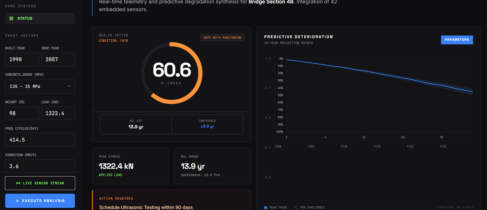
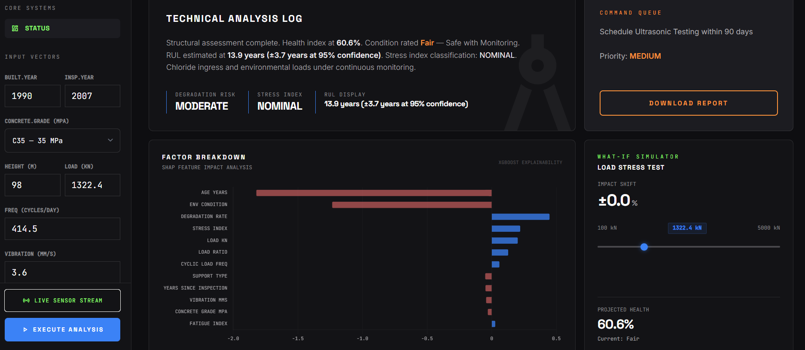

# SHPS v2.0 — Structural Health Prediction System

**Predictive asset management for civil infrastructure** — turns raw sensor telemetry into maintenance decisions with 95% confidence intervals and explainable AI.

**Live Demo**: [huggingface.co/spaces/ripunjkashyap-a11y/shps-v2](https://huggingface.co/spaces/ripunjkashyap-a11y/shps-v2)

---

## Screenshots


*Health index gauge (60.6), RUL estimate with ±3.9yr confidence interval, and 25-year LSTM deterioration forecast*


*SHAP factor breakdown showing age and environmental condition as primary risk drivers, alongside the What-If load stress simulator*

---

## What It Does

An engineer inputs 9 sensor readings (vibration, load, concrete grade, etc.) and gets back:

- **Health Score** (0–100) with condition grade and safety status
- **Remaining Useful Life** — median estimate with a 95% confidence interval (`± N years`)
- **25-Year Deterioration Forecast** — temporal degradation curve with confidence band
- **SHAP Feature Attribution** — exactly which factors are driving the risk score
- **What-If Simulation** — real-time score response to parameter changes via sliders
- **PDF Audit Report** — server-generated, includes charts, SHAP analysis, and maintenance roadmap

---

## Tech Stack

| Layer | Technology |
|---|---|
| ML Models | XGBoost (health + RUL), Keras/TensorFlow LSTM (forecast) |
| Explainability | SHAP `TreeExplainer` with KMeans background (interventional, <50ms) |
| Feature Engineering | 9 raw inputs → 14 physics-informed features (stress index, fatigue index, degradation rate) |
| Validation | Pydantic v2 with cross-field physics guardrails |
| API | Flask 3.1, Flask-CORS, 6 REST endpoints |
| Report Generation | ReportLab (in-memory PDF, matplotlib charts embedded) |
| Containerization | Docker (multi-stage build, port 7860) |

---

## Model Performance

| Model | Task | R² | MAE | RMSE |
|---|---|---|---|---|
| XGBoost Health | Static integrity score (0–100) | 0.89 | 4.04 | 5.09 |
| XGBoost RUL | Remaining Useful Life (years) | 0.98 | 1.58 | 1.96 |
| LSTM | 25-year deterioration forecast | — | 0.98 | 1.33 |

---

## Key Engineering Decisions

**1. Quantile Regression for Safety-Asymmetric Problems**

Standard regression minimises average error (MSE), which is dangerous for infrastructure — underestimating risk costs lives. The RUL model trains three separate XGBoost models at quantiles `[0.025, 0.5, 0.975]` to produce a calibrated 95% confidence interval. The UI surfaces the lower bound as a "safety buffer" to bias toward early maintenance.

**2. Decoupled Model Committee**

The health score (XGBoost) and the long-term forecast (LSTM) operate on the same physics feature manifold but are completely independent pipelines. Feeding the health score into the LSTM would create a single point of failure — a noisy sensor reading would corrupt a 25-year forecast. Decoupling isolates errors to their source.

**3. Physics-Informed Validation Layer**

Pydantic `model_validator` enforces domain rules at the API boundary — e.g. rejecting payloads where `load_kn > 4000` with `concrete_grade_mpa < 30`, a structural impossibility. This prevents garbage-in/garbage-out predictions without model retraining.

**4. Fast SHAP via KMeans Background**

The SHAP background dataset (10,000-row training manifold) is compressed to 100 KMeans centroids at server startup. This keeps interventional SHAP inference under 50ms per request, making it viable for real-time UI updates.

---

## Architecture

```
Sensor Inputs (9 fields)
        │
        ▼
Pydantic Physics Guardrails
        │
        ▼
Feature Engineering (14 features)
   ┌────┴────┬──────────────┐
   ▼         ▼              ▼
XGBoost   XGBoost RUL    LSTM
Health    (Q0.025/0.5/   Forecast
Score     0.975)         (25 yr)
   │         │              │
   └────┬────┘              │
        ▼                   ▼
  SHAP Explainer      Deterioration
  (interventional)     Curve + CI
        │
        ▼
  Flask REST API  →  Dashboard UI  →  PDF Report
```

---

## API Reference

| Method | Endpoint | Description |
|---|---|---|
| POST | `/predict` | Health score + RUL with 95% CI |
| POST | `/forecast` | 25-year LSTM deterioration series |
| POST | `/explain` | SHAP feature attributions |
| POST | `/whatif` | Score delta for a single parameter change |
| POST | `/simulate` | Multi-point what-if sweep |
| POST | `/report` | Generate and download PDF report |

**Sample request / response:**

```bash
POST /predict
```
```json
{
  "construction_year": 2008,
  "last_inspection_year": 2021,
  "concrete_grade_mpa": 30,
  "elevation_m": 20.0,
  "load_kn": 350.0,
  "cyclic_load_freq": 120.0,
  "support_type": 2,
  "env_condition": 3,
  "vibration_mms": 3.2
}
```
```json
{
  "health_score": 74.3,
  "condition": "Fair",
  "safety_status": "Safe with Monitoring",
  "RUL_years": 18.4,
  "RUL_confidence_low": 14.1,
  "RUL_confidence_high": 22.7,
  "RUL_display": "18.4 years (±4.3 years at 95% confidence)",
  "maintenance_action": { "priority": "medium", "label": "Schedule inspection within 90 days" }
}
```

---

## Local Setup

```bash
git clone https://github.com/ripunjkashyap-a11y/shps-v2.git
cd shps-v2
pip install -r requirements.txt
python api/app.py
# → http://localhost:5005
```

**Docker:**
```bash
docker build -t shps-v2 .
docker run -p 7860:7860 shps-v2
```

---

**Author**: Ripunjay Kashyap
